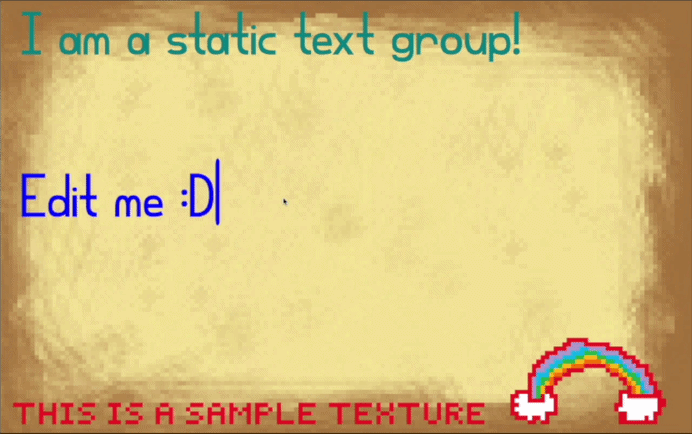
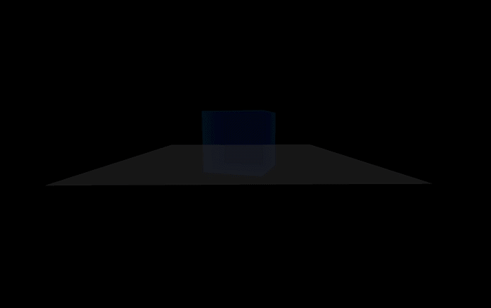
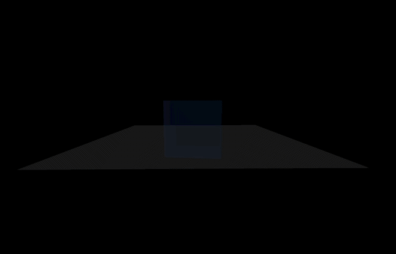
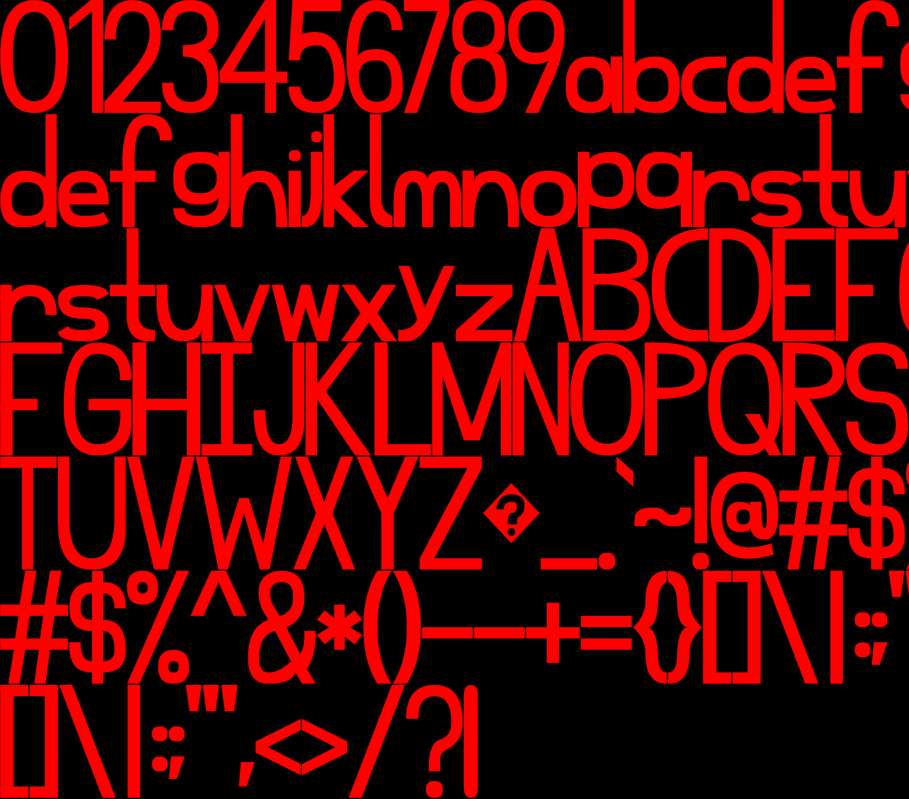

# Far Stars Game Engine

A lightweight C++ game engine optimized for MacOS.

## Table of Contents
- [About](#about)
- [Audio Engine](#audio-engine)
- [UI Engine](#ui-engine)
- [Usage](#usage)

## About

This project started on March 25th, 2024, based off of the Apple Metal Transparency Demo. The goal of the engine is to teach myself fundamental programming concepts while creating a viable game engine that I plan to create a video game with. This game engine currently consists of a disabled audio engine (which I plan to redo in the future with more advanced audio technology and use lower-level API's), and a UI Engine (which includes a text engine). The Text Engine has a custom font created with and for this project. 

This project is unique in the fact that user-made code is written in C++, similar to Unreal Engine. However, unlike Unreal Engine, it is very lightweight, highly customizable (you will be able to edit source code in the same IDE you edit the user-made code), and very simple to use (thus giving it a shallow learning curve).

Currently this version is being worked on. I plan to add many more features in the future, such as support for complex rendering pathways, and a fundamental user UI.


## Audio Engine

The audio engine is currently disabled (commented out). However, it does play sound if uncommented and used. The reason for it to be commented out is so that I can in the future design a better audio engine with lower level API's built around spacial sound.


## UI Engine

The UI engine contains the text engine. The UI engine itself supports UI states. The UI state of 0 is always visible ontop of gameplay. It may contain health, a hotbar, etc. If the UI state is not 0, the graphics of state 0 remain visible. Ontop of that however is a different UI. Cureently, there are 3 additional UI states. There may be an infinite number, integer size limits allowing.

The first additional UI state is "Notes" (denoted in the files as Notes-1). It is a mock up for text editing, and texture rendering. The text engine will be brought up later.



The second additional UI state is "KeyBinds" (denoted as KeyBinds-2). This UI state allows the rebinding of keys. It also demonstrates scrolling support. It contains buttons, text, and static elements.



The third additional UI state is "Debug" (denoted as Debug-3). This UI state has no UI elements, only text. It displays the FPS, position of the player, and aspect ratio. It may be edited easily in the future to display more or more complex values. 



The main focus of the text editor is support for batched inputs (i.e. typing multiple things at once OR if the game slows down for any other reason, no keystrokes will be lost, and they will be updated in the most efficient manor). The text editor supports adding, deleting, highlighting, copying, cuting, pasting text, and selecting all. The text editor also supports multiple text groups, each with unique parameters (such as you can only type integers). These parameters may include restricitons on size (such as you can only type three lines OR you can only type 70 characters.), or details about what the font looks like (color or visual size).


The font is custom made in an older version of this program. It contains 97 unique symbols, as well as 3 spacing characters ('\0', ' ', '\n'). The font is called Prime Grandeur Bold. An image is generated for the highest resolution text on screen. Each symbol is represented as quadratic Beziér curves. This text references this texture. This allows more efficent text display, as the expensive curve intersection code only needs to be ran when there is a new largest text group or if the screen resolution changes. In the image, each letter has a border of 5 pixels to prevent the edge of one letter being seen in the next.




## Usage


To create a UI state, first find a name and unused UI state numeration, such as `Shop` and `5`. 

Add these methods to the UI controller, replacing `Shop` with the name of the new UI state.

```c++
    void loadShop();
    void switchUIStateShop();
    void stepUILogicShop(uint8_t currentBufferIndex);
    void drawShop(id<MTLRenderCommandEncoder> renderEncoder, uint8_t currentBufferIndex);
```

Next, create a file `Shop-5.h`. Define each function.

```c++
void UIController::loadShop(){
    
    _numElementsStatic = 0; // 0 static elements
    _numElementsButtons = _numElementsStatic + 1; // 1 button
    _numElementsDraggable = _numElementsButtons + 0; // 0 draggable items
    _numElementsTextFeilds = _numElementsDraggable + 2; // 2 buttons
    
    std::vector<GUIVertex> elements = {
        // Define each element, referencing the below two variables
    };
    
    static const GUIVertexUniforms elementSizes[] = {
        // Define each size that is seen
    };
    
    static const GUITextureUniforms elementTextures[] = {
        // Define each texture that is seen
    };
    
    
    // ...
    
    // Add text groups by calling this fuction
    _stateXTextGroups = addTextGroups(textGroupsStatic, textGroupsChangeable, {titleParams});

    // Set the buffer values
    _stateXElementSizes = [_device newBufferWithBytes:elementSizes
                                                      length:sizeof(elementSizes)
                                                     options:MTLResourceStorageModeShared];
    
    _stateXElementTextures = [_device newBufferWithBytes:elementTextures
                                                         length:sizeof(elementTextures)
                                                        options:MTLResourceStorageModeShared];
    
    _stateXElements = [_device newBufferWithBytes:elements.data()
                                                         length:elements.size()*sizeof(GUIVertex)
                                                        options:MTLResourceStorageModeShared];
    

    // Load the textures
    MTKTextureLoader* textureLoader = [[MTKTextureLoader alloc] initWithDevice:_device];
    
    NSDictionary *textureLoaderOptions =
    @{
        MTKTextureLoaderOptionTextureUsage       : @(MTLTextureUsageShaderRead),
        MTKTextureLoaderOptionTextureStorageMode : @(MTLStorageModePrivate)
    };
    
    _stateXTextureMap = [textureLoader newTextureWithName:@"KeyBinds-2"
                                              scaleFactor:1.0
                                                   bundle:nil
                                                  options:textureLoaderOptions
                                                    error:nullptr];

    // Apply max scrolling value if applicable (otherwise scrolling will be disabled)
    [_mtkView setScrollingBottomDistTo:-scrollingBottomDist-1];
    
    // Recalculate the character Atlas size to the new UI
    recalculateCharacterAtlas(int(_mtkView.drawableSize.height));
    
}

void UIController::switchUIStateShop(){
    if ([_mtkView getKey:OPEN_SHOP]){ // You can bind a keybind to opening / closing a UI State. Edit "KeyBinds.h"
            if(_state!=0){ // Unload shop
                _state = 0;
                popTextGroups(_stateXTextGroups); // Free the text groups created earlier
                [_mtkView disableScrolling]; // Disable scrolling if necessary
                _playerController->unlockCameraLockMouse();
            } else { // Load shop
                _state = 5; // Shop UI numeration
                loadShop();
                _playerController->lockCameraUnlockMouse();
            
        }
        [_mtkView clearKey:OPEN_SHOP]; // Clear the key (prevent flickering)
    }
}

void UIController::stepUILogicKShop(uint8_t currentBufferIndex){
    
    // Get the mouse pos
    CGPoint mousePos = [_mtkView getMousePos];
    
    mousePos.x /= ((_aspect < 1.6f) ? 1/1.6 : (1/_aspect));
    mousePos.y /= ((_aspect > 1.6f) ? 1 : _aspect/1.6);
    
    mousePos.y -= *_scrollOffset;
    
    
    // Follow logic as layed out in UIBackend or write your own logic
    
    
}


// Draw basic UI
void UIController::drawShop (id<MTLRenderCommandEncoder> renderEncoder, uint8_t currentBufferIndex)
{
    [renderEncoder pushDebugGroup:@"Font Designer UI"];
    
    [renderEncoder setVertexBuffer:_stateXElements
                            offset:0
                           atIndex:0];
    
    [renderEncoder setVertexBuffer:_stateXElementSizes
                            offset:0
                           atIndex:1];
    
    [renderEncoder setVertexBytes:&_aspect
                            length:sizeof(_aspect)
                           atIndex:2];
    
    [renderEncoder setVertexBytes:_scrollOffset
                            length:sizeof(float)
                           atIndex:4];
    
    [renderEncoder setVertexBuffer:_stateXElementTextures
                            offset:0
                           atIndex:3];
    
    [renderEncoder setFragmentTexture:_stateXTextureMap atIndex:0];
    
    [renderEncoder drawIndexedPrimitives:MTLPrimitiveTypeTriangle
                              indexCount:6
                               indexType:MTLIndexTypeUInt16
                             indexBuffer:_squareIndexBuffer
                       indexBufferOffset:0
                           instanceCount:_numElementsTextFeilds];
    
    [renderEncoder popDebugGroup];
}
```


Finally, include your file at the end of `UI.h`:

```c++
// ...
#include "Shop-5"

```

